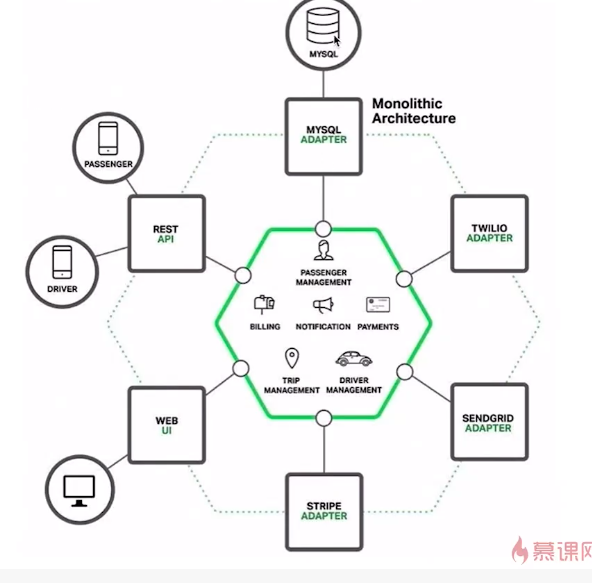
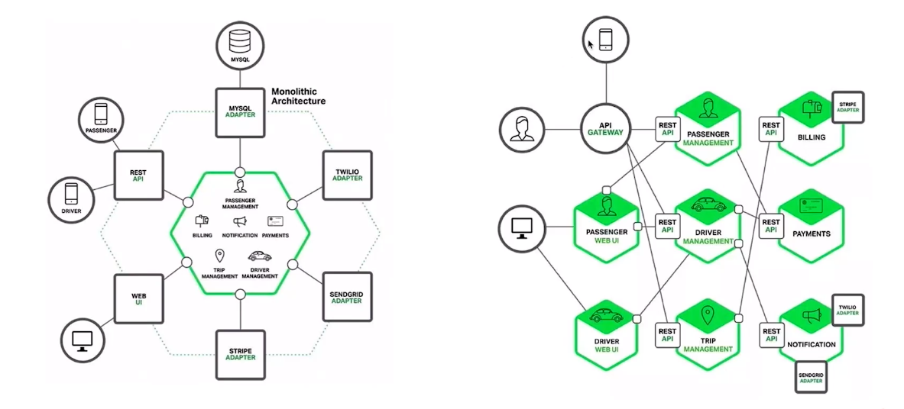
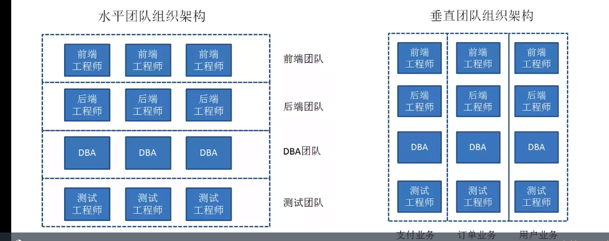
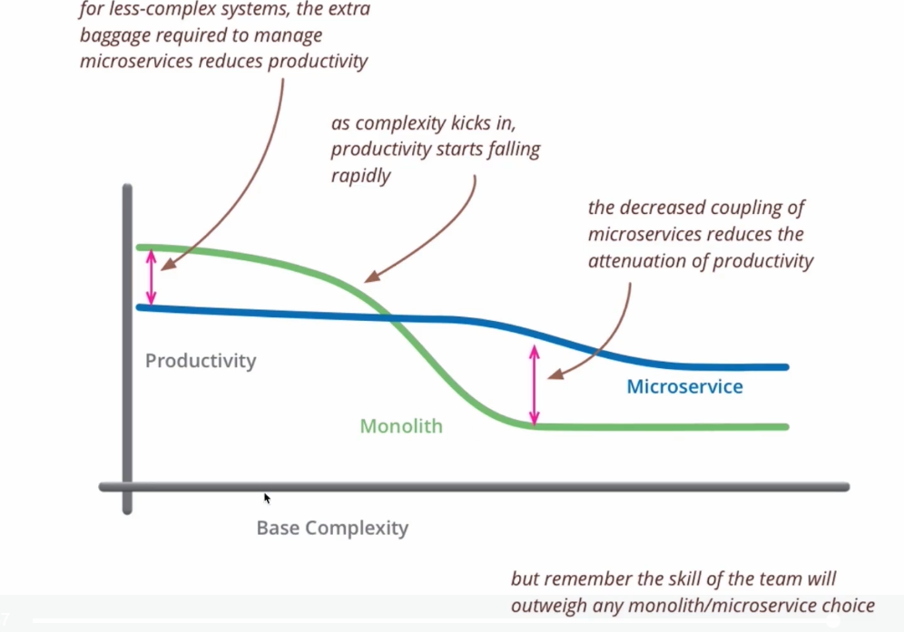

# 微服务介绍

什么是微服务

微服务的特点

微服务服务的优缺点

两大门派: Spring Cloud 和 Dubbo

微服务的拆分: 常用的拆分规则和场景

微服务扩展: 水平扩展和纵向扩展

微服务的重要模块: 注册, 发现, 网关, 负载均衡. 模块和典型选型

# 什么是微服务

## 微服务和单体服务

单体服务:

* 部署效率低下. 代码, 依赖越来越多. 编译打包部署时间很长. 线上发布, 服务启动时间很长. 一般又灰度发布, 每次上线时间太长.
* 团队写作开发成本过高. 
* 系统可用性差. 所有功能在同一个包, 系统跑在一个进程内, 一个功能出现问题, 整个都会出现问题.

---

针对这些问题, 提出了服务化的思想:

* 把传统的单机应用中的本地方法调用, 改造成通过**RPC, HTTP产生的远程方法调用**.

* 把模块从单体应用中拆分出来, 独立成一个服务部署 -> 代码复用, 业务理解, 解耦

* 例如: 用户模块就可以独立开发, 测试, 上线和运维, 可以交由专门的团队来做, **与主模块不耦合**

请求走到网关进行转发, 微服务中一个一个独立模块, 对外通过api提供服务

---

微服务:

* 一种架构风格

* 开发单个应用作为一系列**小型服务**(用户模块, 订单模块等)的套件, 其中每个服务都运行在**自己的进程**中, 并且通过**轻量级的机制**实现彼此间的通信, 这通常是**HTTP**资源API

* 这些服务是围绕着业务功能构建的, 并且可以通过完全**自动化的部署**机制进行独立部署

* 这些服务的集中式管理做到了最小化(例如docker相关技术), 每一种服务都可以通过**不同的编程语言**进行编写, 并且可以使用**不同的数据存储技术**

## 微服务的特点

* 组件以**服务**形式来提供. 微服务是面向服务的, 以独立部署的服务来作为一个个组件, 而不是提供类库和方法之间的本地调用. 需要明确服务之间的接口和协议
* 微服务是产品不是项目. 对产品的整个生命周期负责, 
* 轻量级通信, 独立进程. 更倾向于RESTful, rpc, http. 轻量级的消息队列, rabbitMQ. 
* **分散**治理, 去中心化治理. 责任下放, 需要告警等监控
* **容错性**设计. 每个服务独立, 对每个模块需要有日常的故障检测, 某个模块出错会导致其他模块
* 团队组织架构的调整

## 微服务的优缺点

优点:

* 服务简单, 便于学习和上手, 相对易于维护. 一开始模块少
* 独立部署, **灵活**扩展

* 技术栈丰富. 可以实验新技术, 从边缘模块开始

缺点:

* 运维成本过高

* 接口可能不匹配. 

* 代码可能重复
* 架构复杂度提高. 每一个模块的复杂度降低, 但是整体架构更复杂了

---

## 微服务的两个门派

### Spring Cloud和Dubbo

* Spring Cloud: 众多子项目. 成熟的微服务框架系列. 不仅是某一个模块, 而是整个微服务提供解决方案. 众多的子项目: 网关, 配置中心, 服务注册, 服务发现, 智能路由, 全局锁等
* dubbo: 高性能, 轻量级的开源Java RPC框架, 它提供了三大核心能力: 
  * 面向接口的远程方法调用
  * 智能容错和负载均衡
  * 服务自动注册和发现

可以看到, dubbo提供的能力是Spring Cloud的一个子集

### 整体对比

| 核心组件     | Dubbo     | Spring Cloud                 |
| ------------ | --------- | ---------------------------- |
| 服务注册中心 | Zookeeper | Spring Cloud Netflix Eureka  |
| 服务调用方式 | RPC       | REST API                     |
| 服务网关     | 无        | Spring Cloud Netflix Zuul    |
| 断路器       | 不完善    | Spring Cloud Netflix Hystrix |
| 分布式配置   | 无        | Spring Cloud Config          |
| 服务跟踪     | 无        | Spring Cloud Sleuth          |
| 消息总线     | 无        | Spring Cloud Bus             |
| 数据流       | 无        | Spring Cloud Stream          |
| 批量任务     | 无        | Spring Cloud Task            |

无: 并不是无法实现, 只是dubbo不提供, dubbo可以和其他的框架组件进行整合. 例如:Config可以使用百度的disconf, 淘宝的diamond来实现. 服务跟踪可以使用京东的Hydra. 批量任务可以使用当当Elastic-Job

### 通信协议对比

dubbo: RPC

Spring Cloud: REST(http协议)

* RPC: 整体效率高, 传输同样体量的内容, 网络传输内容更小速度更快. 

* RPC缺点:
  * 服务提供方和消费方依赖方式太强. dubbo RPC不是通用的协议, 需要找到对应的依赖, 代码级别的强依赖. REST类似一纸契约, 不存在强依赖, 也是因为不存在代码级别的强依赖, 可能定义的内容和实际提供的内容不一致
  * dubbo对平台(语言)敏感, 难以简单复用. 如果要对外提供服务, 需要额外实现一层代理, 把RPC接口转换成http才可以对外发布. Spring Cloud本身已经对外提供服务, 更好的复用性

### 文档质量

### 选型建议

# 微服务拆分

# 案例: 新零售业务商品中心微服务化过程

-> 技术专家18周 chapter1 1-7

