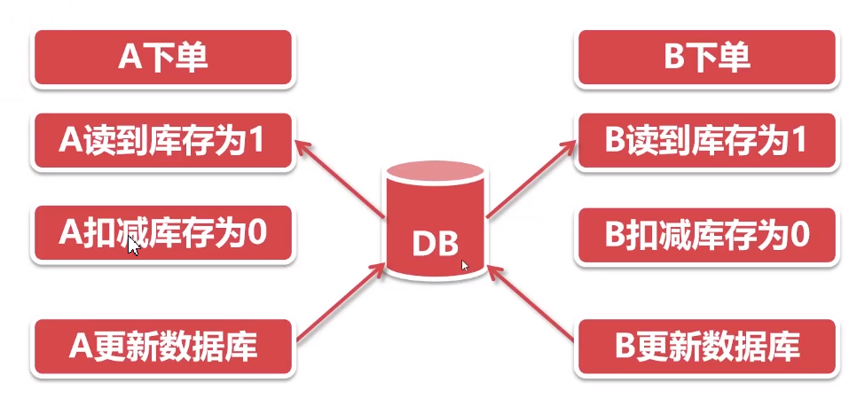
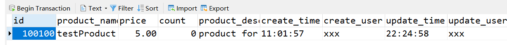
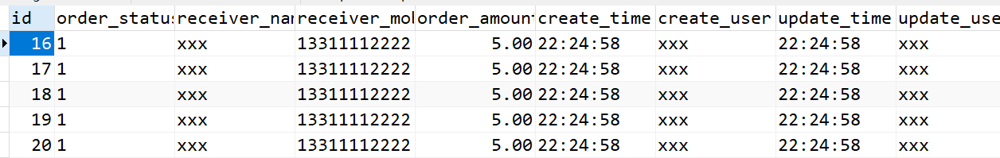
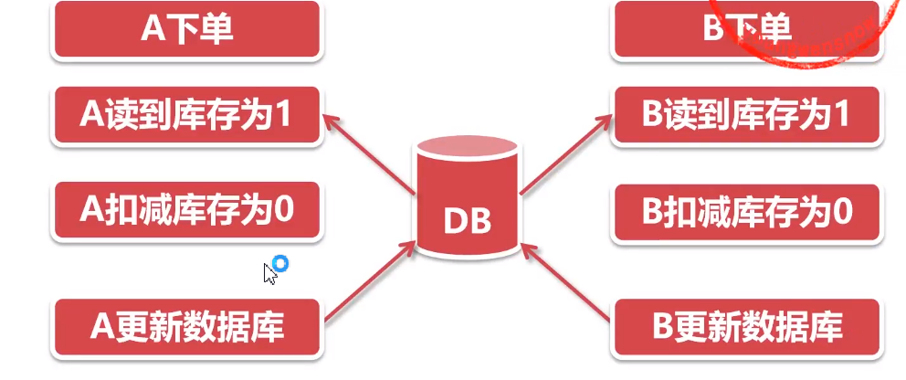
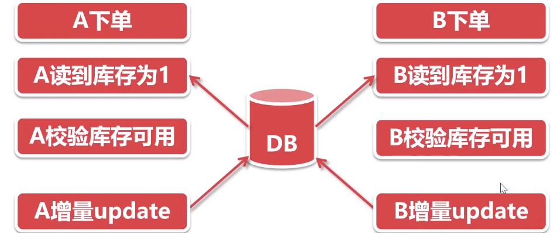

# 锁


# 超卖现象1

举例: 某件商品库存数量10件, 结果卖出了15件

-> 商品卖出数量超出了库存数量

---

* 现象举例:

系统中库存为1，但是产生了两笔订单. -> 卖家发货的时候时候发现只有一个商品,但是有两笔订单, 只可以发给一个买家

* 产生的原因:

商品剩余一件, AB都看上了该商品, 加入购物车, 提交订单. -> 产生并发, 超买导致超卖 -> 扣减库存的时候, 出现了问题

扣减库存: 该动作在程序中进行在程序中计算剩余库存 -> 在并发的情况下, 导致库存计算错误



数据库数据为0, 但是产生了两笔订单. 

* 解决方法

出现问题是在扣减库存的时候, 因此扣减库存不在程序中进行而是通过数据库

向数据库传递库存增量update, 扣减1个库存, 增量为-1. 库存数+增量数

在数据库update语句计算库存, **通过update行锁解决并发**. (行锁: 更新数据的时候给该行加上锁, 其他想要更新同样数据的都不会执行, 等当前的行锁释放才可以执行.)

## 超卖现象1demo

### 数据库设计

数据库表

product商品表

```mysql
-- auto-generated definition
create table product
    (
        id           int            not null
        primary key,
        product_name varchar(255)   not null,
        price        decimal(10, 2) not null,
        count        int            not null,
        product_desc varchar(255)   not null,
        create_time  time           not null,
        create_user  varchar(255)   not null,
        update_time  time           not null,
        update_user  varchar(255)   not null
    );
```

order订单表:

````mysql
-- auto-generated definition
create table `order`
(
    id              int auto_increment
    primary key,
    order_status    varchar(1)     not null,
    receiver_name   varchar(255)   not null,
    receiver_mobile varchar(11)    not null,
    order_amount    decimal(11, 2) not null comment '订单金额',
    create_time     time           not null,
    create_user     varchar(255)   not null,
    update_time     time           not null,
    update_user     varchar(255)   not null
);
````

order_item表

```mysql
-- auto-generated definition
create table order_item
(
    id             int auto_increment
    primary key,
    order_id       int            not null,
    product_id     int            not null,
    purchase_price decimal(11, 2) not null,
    purchase_num   int(3)         not null,
    create_time    time           not null,
    create_user    varchar(255)   not null,
    update_time    time           not null,
    update_user    varchar(255)   not null
);
```

### 在代码中实现扣减库存操作, 超卖现象1

OrderServiceImpl1: 

```java
package com.example.distributedemo.service.impl;

import com.example.distributedemo.dao.OrderItemMapper;
import com.example.distributedemo.dao.OrderMapper;
import com.example.distributedemo.dao.ProductMapper;
import com.example.distributedemo.model.Order;
import com.example.distributedemo.model.OrderItem;
import com.example.distributedemo.model.Product;
import com.example.distributedemo.service.OrderService;
import lombok.extern.slf4j.Slf4j;
import org.springframework.beans.factory.annotation.Autowired;
import org.springframework.stereotype.Service;
import org.springframework.transaction.PlatformTransactionManager;
import org.springframework.transaction.TransactionDefinition;
import org.springframework.transaction.TransactionStatus;

import javax.annotation.Resource;
import javax.transaction.Transactional;
import java.math.BigDecimal;
import java.util.Date;
import java.util.concurrent.locks.Lock;
import java.util.concurrent.locks.ReentrantLock;

/**
 * 超卖问题:
 * 在代码中实现扣减库存操作
 */
@Service
@Slf4j
public class OrderServiceImpl1 implements OrderService {

    @Resource
    private OrderMapper orderMapper;
    @Resource
    private OrderItemMapper orderItemMapper;
    @Resource
    private ProductMapper productMapper;
    //购买商品id
    private int purchaseProductId = 100100;
    //购买商品数量
    private int purchaseProductNum = 1;


    /**
     * 在代码中实现扣减库存操作
     */
    @Transactional(rollbackOn = Exception.class)
    @Override
    public Integer createOrder() throws Exception {
        // ------------------------ 在程序中计算库存的数量 ------------------------
        Product product = productMapper.selectByPrimaryKey(purchaseProductId);
        if (product == null) {
            throw new Exception("购买商品：" + purchaseProductId + "不存在");
        }

        // 商品当前库存
        Integer currentCount = product.getCount();

        // 重要: 校验库存
        if (purchaseProductNum > currentCount) {
            throw new Exception("商品" + purchaseProductId + "仅剩" + currentCount + "件, 无法购买");
        }

        // 计算剩余库存
        Integer leftCount = currentCount - purchaseProductNum;
        // 更新库存
        product.setCount(leftCount);
        product.setUpdateTime(new Date());
        product.setUpdateUser("xxx");
        productMapper.updateByPrimaryKeySelective(product);

        // ------------------------ 创建订单 ------------------------
        Order order = new Order();
        order.setOrderAmount(product.getPrice().multiply(new BigDecimal(purchaseProductNum)));
        order.setOrderStatus(1);//待处理
        order.setReceiverName("xxx");
        order.setReceiverMobile("13311112222");
        order.setCreateTime(new Date());
        order.setCreateUser("xxx");
        order.setUpdateTime(new Date());
        order.setUpdateUser("xxx");
        orderMapper.insertSelective(order);

        OrderItem orderItem = new OrderItem();
        orderItem.setOrderId(order.getId());
        orderItem.setProductId(product.getId());
        orderItem.setPurchasePrice(product.getPrice());
        orderItem.setPurchaseNum(purchaseProductNum);
        orderItem.setCreateUser("xxx");
        orderItem.setCreateTime(new Date());
        orderItem.setUpdateTime(new Date());
        orderItem.setUpdateUser("xxx");
        orderItemMapper.insertSelective(orderItem);
        return order.getId();
    }
}
```

测试类:

```java
package com.example.distributedemo;

import com.example.distributedemo.service.OrderService;
import com.example.distributedemo.service.impl.OrderServiceImpl;
import org.junit.Test;
import org.junit.runner.RunWith;
import org.springframework.beans.factory.annotation.Autowired;
import org.springframework.beans.factory.annotation.Qualifier;
import org.springframework.boot.test.context.SpringBootTest;
import org.springframework.test.context.junit4.SpringRunner;

import java.util.concurrent.CountDownLatch;
import java.util.concurrent.CyclicBarrier;
import java.util.concurrent.ExecutorService;
import java.util.concurrent.Executors;

@RunWith(SpringRunner.class)
@SpringBootTest
public class DistributeDemoApplicationTests {

    // 代码中实现扣除库存
    @Qualifier("orderServiceImpl1")
    @Autowired
    private OrderService orderService;

    @Test
    public void concurrentOrder() throws InterruptedException {
        Thread.sleep(60000);

        CountDownLatch countDownLatch = new CountDownLatch(5);

        // 等5个线程
        CyclicBarrier cyclicBarrier = new CyclicBarrier(5);

        ExecutorService es = Executors.newFixedThreadPool(5);
        for (int i = 0; i < 5; i++) {
            es.execute(() -> {
                try {
                    // 所有线程都在这里等待, 等到某一时刻到达同时往下运行
                    // 保证创建订单方法是并发执行的
                    cyclicBarrier.await();
                    Integer orderId = orderService.createOrder();
                    System.out.println("订单id：" + orderId);
                } catch (Exception e) {
                    e.printStackTrace();
                } finally {
                    countDownLatch.countDown();
                }
            });
        }
        // 等5个线程都执行完了之后再执行,
        // 和具体业务无关, 与数据库连接池有关
        // 如果不加闭锁, 主线程结束后数据库连接池就关闭了, 所有的新开的线程就无法获取到数据库连接
        // 所以添加闭锁, 等5个线程执行完之后再关闭主线程
        countDownLatch.await();
        es.shutdown();
    }
}
```

注意其中的CountDownLatch和CyclicBarrier的作用

运行后发现:

```
订单id：16
订单id：17
订单id：18
订单id：19
订单id：20
```

只有一个库存的商品, 库存变为0



但是产生了5个订单:



问题出现, 出现了5个订单, 但是实际上只有一件商品, 超卖现象!

---

解决方法1: 原本是在数据库中做库存扣减, 现在将操作下沉到数据库中, 使用update行锁

### 解决: 数据库行锁

原先的代码中的库存扣减逻辑删除, 

OrderServiceImpl2_dbupdate:

```java
// 计算剩余库存
// Integer leftCount = currentCount - purchaseProductNum;
// 更新库存
// product.setCount(leftCount);
// product.setUpdateTime(new Date());
// product.setUpdateUser("xxx");
// productMapper.updateByPrimaryKeySelective(product);

// 使用数据库行锁解决超卖
productMapper.updateProductCount(purchaseProductNum, "xxx", new Date(), product.getId());
```

ProductMapper.java中

```java
/**
     * 将原先在代码中扣减库存下放到使用数据库行锁扣减库存
     */
int updateProductCount(@Param("purchaseProductNum") int purchaseProductNum,
                       @Param("updateUser") String xxx,
                       @Param("updateTime") Date date,
                       @Param("productId") Integer productId);
```

ProductMapper.xml中

```xml
<!-- 行锁解决超卖 -->
<update id="updateProductCount">
    update product
    set count       = count - #{purchaseProductNum,jdbcType=INTEGER},
    update_user = #{updateUser,jdbcType=VARCHAR},
    update_time = #{updateTime,jdbcType=TIME}
    where id = #{productId,jdbcType=INTEGER}
</update>
```

所以就是把原先在程序中扣减库存逻辑: 在程序中计算好剩余的库存, 然后去更新数据库, 在并发的情况下发生超卖.

改造后将扣减库存的方法下放到数据库中, 数据库update增量的方式更新库存:

```xml
set count       = count - #{purchaseProductNum,jdbcType=INTEGER},
```

update有行锁, 五个线程进来只有一个线程可以获得到行锁, 其他线程排队争抢锁做更新.

---

测试:

test中注入该impl

```java
@Qualifier("OrderServiceImpl2_dbupdate")
@Autowired
private OrderService orderService;
```

清空orderItem和order表. 将商品数量改成1, 运行程序. 查看数据库:

可以看到order_item中产生5个订单.

商品的count变成-4

说明行锁生效了, update行锁让5个线程一次执行, 每个都-1

这就是超卖的第二种现象

---

ps:

这里自己机器执行的时候, 因为createOrder之前对比了扣除数量和现在库存的大小, 所以爆出了错误

```java
if (purchaseProductNum > currentCount) {
    throw new Exception("商品" + purchaseProductId + "仅剩" + currentCount + "件, 无法购买");
}
```

```
java.lang.Exception: 商品100100仅剩0件, 无法购买
```

# 超卖现象2

## 场景

回顾:

之前的超卖现象1 -> 使用update行锁解决



解决方法:

* 扣减库存不在程序中进行, 而是通过数据库
* 向数据库传递库存增量, 扣减1个库存, 增量为-1
* 在数据库update语句计算库存, 通过update行锁解决并发

---

但是上一节发现库存扣成了负数, 

-> 超卖的第二个现象:

* 库存扣成了负数, 导致卖家询问客服情况

产生原因:

* 并发检验库存, 造成库存充足的假象. 只有一个库存, 两个人同时下单, 检索扣减数量都满足库存, 程序继续执行update操作, 两个update语句依次执行.




关键的步骤在于:

```java
if (purchaseProductNum > currentCount) {
    throw new Exception("商品" + purchaseProductId + "仅剩" + currentCount + "件, 无法购买");
}
```

校验库存的时候, 因为是并发执行, 所以每一个线程判断条件都可能满足, 然后执行更新操作

所以需要修改检索库存和校验库存的逻辑.

法一:

在update行锁之后再校验库存, 如果为负数, 则抛出异常. 抛出异常后更新操作回滚. 

```java
Product product = productMapper.selectByPrimaryKey(purchaseProductId);
if (product == null) {
    throw new Exception("购买商品：" + purchaseProductId + "不存在");
}

// 商品当前库存
Integer currentCount = product.getCount();

// 重要: 校验库存
if (purchaseProductNum > currentCount) {
    throw new Exception("商品" + purchaseProductId + "仅剩" + currentCount + "件，无法购买");
}

// 使用数据库行锁解决超卖
productMapper.updateProductCount(purchaseProductNum, "xxx", new Date(), product.getId());


// 校验库存
// 如果库存为负数, 报错
...
```

了解即可, 这里使用锁来解决

---

方法二: 锁

1. 校验库存, 扣减库存统一加锁, 使之成为原子性操作. 并发时，只有获得锁的线程才能校验、扣减库存

2. 扣减库存结束后，释放锁. 确保库存不会扣成负数

-> 基于Synchronized锁解决超卖问题(最原始的锁); 

-> 基于ReentrantLock锁解决超卖问题

## 基于Synchronized锁解决超卖问题

### 方法锁


校验库存和扣减库存的时候加锁


方法上加synchronized锁, 只有一个线程可以进入该方法

```java
@Transactional(rollbackOn = Exception.class)
@Override
public synchronized Integer createOrder() throws Exception {
    // ------------------------ 在程序中计算库存的数量 ------------------------
    Product product = productMapper.selectByPrimaryKey(purchaseProductId);
    if (product == null) {
        throw new Exception("购买商品：" + purchaseProductId + "不存在");
    }

    // 商品当前库存
    Integer currentCount = product.getCount();

    // 重要: 校验库存
    if (purchaseProductNum > currentCount) {
        throw new Exception("商品" + purchaseProductId + "仅剩" + currentCount + "件，无法购买");
    }

    // 计算剩余库存
    // Integer leftCount = currentCount - purchaseProductNum;
    // 更新库存
    // product.setCount(leftCount);
    // product.setUpdateTime(new Date());
    // product.setUpdateUser("xxx");
    // productMapper.updateByPrimaryKeySelective(product);


    // 使用数据库行锁解决超卖
    productMapper.updateProductCount(purchaseProductNum, "xxx", new Date(), product.getId());


    // 校验库存
    // 如果库存为负数, 报错

    // ------------------------ 创建订单 ------------------------
    
}
```

product中库存改成1, 然后清空order和order_item表, 运行后查看

查看console, 可以看到后面的线程抛出错误, 但是又在最后生成了新订单:

```
pool-1-thread-4库存数：1
pool-1-thread-3库存数：1
订单id: 37
pool-1-thread-2库存数：0
pool-1-thread-1库存数：0
java.lang.Exception: 商品100100仅剩0件，无法购买
pool-1-thread-5库存数：0
java.lang.Exception: 商品100100仅剩0件，无法购买
java.lang.Exception: 商品100100仅剩0件，无法购买
订单id: 38
```

可以看到线程3和线程4读到的库存都是1, 为什么两个线程读取到的是1?

查看程序可以看到

```java
@Transactional(rollbackOn = Exception.class)
@Override
public synchronized Integer createOrder() throws Exception {}
```

锁只锁住了当前的方法, 方法之前完之后, 锁就释放, 其他线程可以进入. 第一个线程更新完之后, 数据库并没有修改, 因为事务还没有提交, 但是第二个线程已经进来了, 又检索数据, 查到的是提交数据之前的数据, 所有库存还是1

简单来说就是, 第一个线程中事务还没有提交,方法执行结束了. 第二个线程进来查询到数据库中库存还是1.

---

解决方法: 使用锁把事务锁起来, 保证事务的提交也在锁的范围内, 事务提交时候再释放锁.

需要手动控制事务. 

1. 删除事务注解

2. 注入两个类

```java
@Autowired
private PlatformTransactionManager platformTransactionManager;

@Autowired
private TransactionDefinition transactionDefinition;
```

3. 手动控制事务

在进入的时候获得事务, 在最后提交事务, 报错的时候rollback

```java
@Override
public synchronized Integer createOrder() throws Exception {

    TransactionStatus transaction = platformTransactionManager.getTransaction(transactionDefinition);


    // ------------------------ 在程序中计算库存的数量 ------------------------
    Product product = productMapper.selectByPrimaryKey(purchaseProductId);
    if (product == null) {
        platformTransactionManager.rollback(transaction);
        throw new Exception("购买商品：" + purchaseProductId + "不存在");
    }

    // 商品当前库存
    Integer currentCount = product.getCount();
    // 当前线程名称
    System.out.println(Thread.currentThread().getName() + "库存数: " + currentCount);

    // 重要: 校验库存
    if (purchaseProductNum > currentCount) {
        platformTransactionManager.rollback(transaction);
        throw new Exception("商品" + purchaseProductId + "仅剩" + currentCount + "件，无法购买");
    }

    // 计算剩余库存
    // Integer leftCount = currentCount - purchaseProductNum;
    // 更新库存
    // product.setCount(leftCount);
    // product.setUpdateTime(new Date());
    // product.setUpdateUser("xxx");
    // productMapper.updateByPrimaryKeySelective(product);


    // 使用数据库行锁解决超卖
    productMapper.updateProductCount(purchaseProductNum, "xxx", new Date(), product.getId());


    // 校验库存
    // 如果库存为负数, 报错

    // ------------------------ 创建订单 ------------------------
    Order order = new Order();
    order.setOrderAmount(product.getPrice().multiply(new BigDecimal(purchaseProductNum)));
    order.setOrderStatus(1);//待处理
    order.setReceiverName("xxx");
    order.setReceiverMobile("13311112222");
    order.setCreateTime(new Date());
    order.setCreateUser("xxx");
    order.setUpdateTime(new Date());
    order.setUpdateUser("xxx");
    orderMapper.insertSelective(order);

    OrderItem orderItem = new OrderItem();
    orderItem.setOrderId(order.getId());
    orderItem.setProductId(product.getId());
    orderItem.setPurchasePrice(product.getPrice());
    orderItem.setPurchaseNum(purchaseProductNum);
    orderItem.setCreateUser("xxx");
    orderItem.setCreateTime(new Date());
    orderItem.setUpdateTime(new Date());
    orderItem.setUpdateUser("xxx");
    orderItemMapper.insertSelective(orderItem);
    platformTransactionManager.commit(transaction);
    return order.getId();
}
```

整个事务都在锁内

运行后:

```
pool-1-thread-4库存数：1
订单id: 37
pool-1-thread-3库存数：0
java.lang.Exception: 商品100100仅剩0件，无法购买
pool-1-thread-2库存数：0
java.lang.Exception: 商品100100仅剩0件，无法购买
pool-1-thread-1库存数：0
java.lang.Exception: 商品100100仅剩0件，无法购买
pool-1-thread-5库存数：0
java.lang.Exception: 商品100100仅剩0件，无法购买
```

查看数据库, 库存为0, 成功解决.


### 块锁

三种写法:

```java
// 对象锁, 获得this的线程才可以执行同步块内容, this就是当前的类(OrderService)的实例, 单例
synchronized (this) {
}
```

```java
// 对象锁, 类中写一个object, 同上, 获得object对象的锁执行块的内容 . 和写this一样, 都是单例
Object object = new Object();
synchronized (object) {
}
```
上面两种都是对象锁, 线程争抢对象.
```java
// 类锁, 获得orderService类的线程的锁
synchronized (OrderServiceImpl.class) {

}
```

类锁和对象锁的区别:

对象锁: 对象是类new出来的, 有多个对象的时候, 不同的线程要争抢多个对象, 还可能有并发的情况. 

类锁: 只能有一个线程获取到, 类只有一个

```java
package com.example.distributedemo.service.impl;

import com.example.distributedemo.dao.OrderItemMapper;
import com.example.distributedemo.dao.OrderMapper;
import com.example.distributedemo.dao.ProductMapper;
import com.example.distributedemo.model.Order;
import com.example.distributedemo.model.OrderItem;
import com.example.distributedemo.model.Product;
import com.example.distributedemo.service.OrderService;
import lombok.extern.slf4j.Slf4j;
import org.springframework.beans.factory.annotation.Autowired;
import org.springframework.stereotype.Service;
import org.springframework.transaction.PlatformTransactionManager;
import org.springframework.transaction.TransactionDefinition;
import org.springframework.transaction.TransactionStatus;

import javax.annotation.Resource;
import java.math.BigDecimal;
import java.util.Date;

/**
 * synchronized块锁
 *
 * 自己管理事务的提交
 */
@Service("OrderServiceImpl4_synchronized")
@Slf4j
public class OrderServiceImpl4_synchronized implements OrderService {

    @Resource
    private OrderMapper orderMapper;
    @Resource
    private OrderItemMapper orderItemMapper;
    @Resource
    private ProductMapper productMapper;
    //购买商品id
    private int purchaseProductId = 100100;
    //购买商品数量
    private int purchaseProductNum = 1;

    @Autowired
    private PlatformTransactionManager platformTransactionManager;

    @Autowired
    private TransactionDefinition transactionDefinition;

    // @Transactional(rollbackOn = Exception.class)
    @Override
    public Integer createOrder() throws Exception {
        Product product = null;
        synchronized (this) {
            TransactionStatus transaction1 = platformTransactionManager.getTransaction(transactionDefinition);
            product = productMapper.selectByPrimaryKey(purchaseProductId);
            if (product == null) {
                platformTransactionManager.rollback(transaction1);
                throw new Exception("购买商品：" + purchaseProductId + "不存在");
            }

            // 商品当前库存
            Integer currentCount = product.getCount();
            // 当前线程名称
            System.out.println(Thread.currentThread().getName() + "库存数: " + currentCount);

            // 重要: 校验库存
            if (purchaseProductNum > currentCount) {
                platformTransactionManager.rollback(transaction1);
                throw new Exception("商品" + purchaseProductId + "仅剩" + currentCount + "件，无法购买");
            }

            // 使用数据库行锁解决超卖
            productMapper.updateProductCount(purchaseProductNum, "xxx", new Date(), product.getId());

            platformTransactionManager.commit(transaction1);
        }
        // ------------------------ 创建订单 ------------------------
        // 插入的时候也新建事务
        TransactionStatus transaction2 = platformTransactionManager.getTransaction(transactionDefinition);

        Order order = new Order();
        order.setOrderAmount(product.getPrice().multiply(new BigDecimal(purchaseProductNum)));
        order.setOrderStatus(1);//待处理
        order.setReceiverName("xxx");
        order.setReceiverMobile("13311112222");
        order.setCreateTime(new Date());
        order.setCreateUser("xxx");
        order.setUpdateTime(new Date());
        order.setUpdateUser("xxx");
        orderMapper.insertSelective(order);

        OrderItem orderItem = new OrderItem();
        orderItem.setOrderId(order.getId());
        orderItem.setProductId(product.getId());
        orderItem.setPurchasePrice(product.getPrice());
        orderItem.setPurchaseNum(purchaseProductNum);
        orderItem.setCreateUser("xxx");
        orderItem.setCreateTime(new Date());
        orderItem.setUpdateTime(new Date());
        orderItem.setUpdateUser("xxx");
        orderItemMapper.insertSelective(orderItem);
        platformTransactionManager.commit(transaction2);
        return order.getId();
    }
}
```

与上文一致

```
pool-1-thread-5库存数：1
订单id: 37
pool-1-thread-4库存数：0
java.lang.Exception: 商品100100仅剩0件，无法购买
pool-1-thread-3库存数：0
java.lang.Exception: 商品100100仅剩0件，无法购买
pool-1-thread-2库存数：0
java.lang.Exception: 商品100100仅剩0件，无法购买
pool-1-thread-1库存数：0
java.lang.Exception: 商品100100仅剩0件，无法购买
```

## 基于ReentrantLock锁解决超卖问题

```java
package com.example.distributedemo.service.impl;

import com.example.distributedemo.dao.OrderItemMapper;
import com.example.distributedemo.dao.OrderMapper;
import com.example.distributedemo.dao.ProductMapper;
import com.example.distributedemo.model.Order;
import com.example.distributedemo.model.OrderItem;
import com.example.distributedemo.model.Product;
import com.example.distributedemo.service.OrderService;
import lombok.extern.slf4j.Slf4j;
import org.springframework.beans.factory.annotation.Autowired;
import org.springframework.stereotype.Service;
import org.springframework.transaction.PlatformTransactionManager;
import org.springframework.transaction.TransactionDefinition;
import org.springframework.transaction.TransactionStatus;

import javax.annotation.Resource;
import java.math.BigDecimal;
import java.util.Date;
import java.util.concurrent.locks.Lock;
import java.util.concurrent.locks.ReentrantLock;

/**
 * ReentrantLock可重入锁
 * <p>
 * 自己管理事务的提交
 */
@Service("OrderServiceImpl5_ReentrantLock")
@Slf4j
public class OrderServiceImpl5_ReentrantLock implements OrderService {

    @Resource
    private OrderMapper orderMapper;
    @Resource
    private OrderItemMapper orderItemMapper;
    @Resource
    private ProductMapper productMapper;
    //购买商品id
    private int purchaseProductId = 100100;
    //购买商品数量
    private int purchaseProductNum = 1;

    private Lock lock = new ReentrantLock();

    @Autowired
    private PlatformTransactionManager platformTransactionManager;

    @Autowired
    private TransactionDefinition transactionDefinition;

    // @Transactional(rollbackOn = Exception.class)
    @Override
    public Integer createOrder() throws Exception {
        Product product = null;

        lock.lock();
        try {
            TransactionStatus transaction1 = platformTransactionManager.getTransaction(transactionDefinition);
            product = productMapper.selectByPrimaryKey(purchaseProductId);
            if (product == null) {
                platformTransactionManager.rollback(transaction1);
                throw new Exception("购买商品：" + purchaseProductId + "不存在");
            }


            // 商品当前库存
            Integer currentCount = product.getCount();
            // 当前线程名称
            System.out.println(Thread.currentThread().getName() + "库存数: " + currentCount);

            // 重要: 校验库存
            if (purchaseProductNum > currentCount) {
                platformTransactionManager.rollback(transaction1);
                throw new Exception("商品" + purchaseProductId + "仅剩" + currentCount + "件，无法购买");
            }

            // 使用数据库行锁解决超卖
            productMapper.updateProductCount(purchaseProductNum, "xxx", new Date(), product.getId());

            platformTransactionManager.commit(transaction1);
        } finally {
            lock.unlock();
        }


        // ------------------------ 创建订单 ------------------------


        // 插入的时候也新建事务
        TransactionStatus transaction2 = platformTransactionManager.getTransaction(transactionDefinition);

        Order order = new Order();
        order.setOrderAmount(product.getPrice().multiply(new BigDecimal(purchaseProductNum)));
        order.setOrderStatus(1);//待处理
        order.setReceiverName("xxx");
        order.setReceiverMobile("13311112222");
        order.setCreateTime(new Date());
        order.setCreateUser("xxx");
        order.setUpdateTime(new Date());
        order.setUpdateUser("xxx");
        orderMapper.insertSelective(order);

        OrderItem orderItem = new OrderItem();
        orderItem.setOrderId(order.getId());
        orderItem.setProductId(product.getId());
        orderItem.setPurchasePrice(product.getPrice());
        orderItem.setPurchaseNum(purchaseProductNum);
        orderItem.setCreateUser("xxx");
        orderItem.setCreateTime(new Date());
        orderItem.setUpdateTime(new Date());
        orderItem.setUpdateUser("xxx");
        orderItemMapper.insertSelective(orderItem);
        platformTransactionManager.commit(transaction2);
        return order.getId();
    }
}
```

运行后

```
pool-1-thread-5库存数: 1
pool-1-thread-1库存数: 0
java.lang.Exception: 商品100100仅剩0件，无法购买
订单id：28
java.lang.Exception: 商品100100仅剩0件，无法购买
pool-1-thread-3库存数: 0
java.lang.Exception: 商品100100仅剩0件，无法购买
pool-1-thread-4库存数: 0
java.lang.Exception: 商品100100仅剩0件，无法购买
```

# 单体锁的问题

不能跨JVM, 解决该问题: 分布式锁


# 基于数据库的分布式锁


# Redis分布式锁

## Redis分布式锁原理


## 基于Redis实现分布式锁


# zookeeper分布式锁

##  zookeeper基本概念与环境安装


## zookeeper分布式锁原理


## zookeeper分布式锁代码实现


# curator分布式锁


# redisson分布式锁


##  spring和springboot引入redisson


# 多种分布式锁实现方案

优缺点:

| 方式                | 优点                               | 缺点                                                         |
| ------------------- | ---------------------------------- | ------------------------------------------------------------ |
| 数据库              | 实现简单, 易于理解. 基础数据库     | 对数据库压力大. 建议锁数据库和业务数据库分开. <br />即使锁数据库崩掉, 业务数据库不受影响. |
| Redis(自己实现的)   | 易于理解                           | 自己实现(bug), 不支持阻塞(获取不到锁的线程直接返回, 没有等待) |
| Zookeeper           | 支持阻塞(类中的方法, 等待线程唤起) | 需理解Zookeeper, 程序复杂. 自己使用zk编程的频率低            |
| Curator(zk升级版本) | 提供锁的方法                       | 依赖Zookeeper, 强一致(zk集群部署情况下, 获取锁需要把顺时结点同步到所有zk的结点上, 对zk集群压力大). 小缺点, 使用一般不受影响 |
| Redisson            | 提供锁的方法, 可阻塞               |                                                              |

* 不推荐使用自己编写的分布式锁
* 推荐使用Redission和Curator实现的分布式锁


