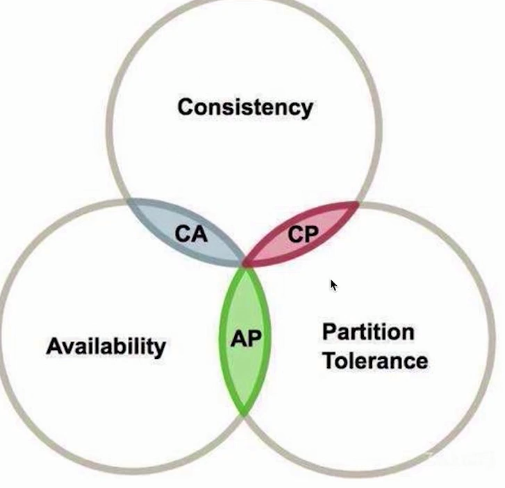
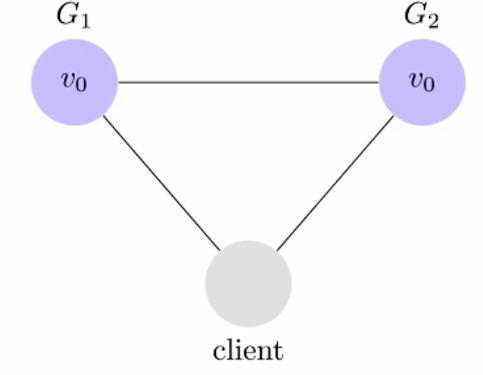
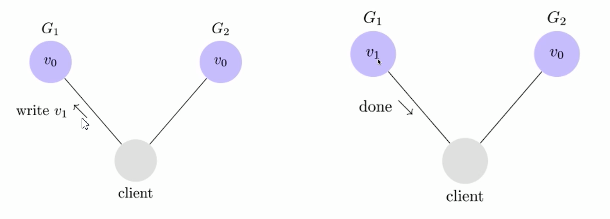
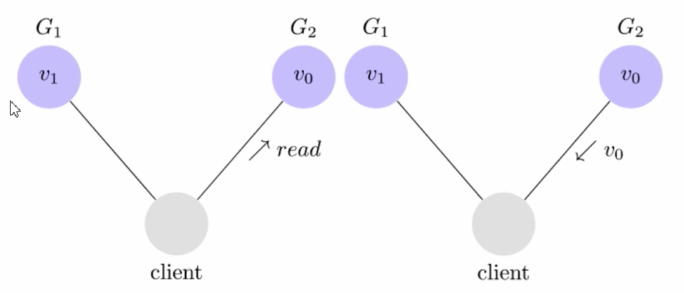
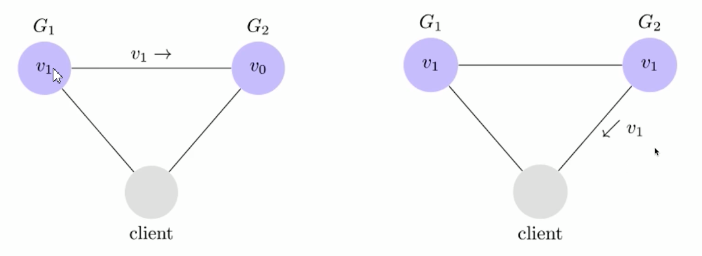

[一文读懂分布式架构知识体系（内含超全核心知识大图）](https://juejin.cn/post/6844903967701336078)

# 介绍

1. 什么分布式

2. 分布式的作用

3. 分布式和单体结构的对比

4. CAP定理

5. 集群, 分布式, 微服务的区别

# 什么是分布式

利用物理架构形成多个自治的处理元素, **不共享主内存**, 但是通过**发送信息**合作. ——Leslie Lamport

- 不共享主内存: 多台独立的机器运作

* 发送消息合作: 机器之间进行通信, 调用服务, 调用接口, 无论是服务还是接口, 无论协议是http还是rpc, 统称为发送消息

---

例子: 单体 -> 集群 -> 分布式

单体: 一台机器做所有的事情. 一个大项目, 大而全, 包括所有的模块, 模块之间直接调用

集群: 同样的单体应用部署到很多的服务器上, 在前面加负载均衡. Client访问的时候访问压力小的机器. 多台机器, 部署同样的应用.

分布式: 术业有专攻: 一台服务器不再提供完整的服务, 拆分成不同的功能, 不同的功能负责自己的业务. 例如需要多个商品目录系统, 其成本比其他模块低, 只需要多加几个商品目录模块, 不需要把整个系统多部署几份. 专业的人做专业的事, 降低成本. 例如: OA: 权限系统, 员工系统, 请假系统(可能5个员工系统, 1个请假系统), 一个请求过来, 系统之间独立并且相互调用

# 分布式的作用

## 为什么需要分布式

实际工作的痛点:

* 单体项目变得臃肿, 复杂度增加. 各种层耦合, 调用冲突. 我改了我的代码, 别人不经意调用了, 我修改了之后, 他也会出错, 或者需要重新测试. 

* 测试上线繁琐
* 开发效率低. 新功能无法摆脱老功能的, 例如升级版本, 换依赖, 升级版本, 升级了别人的代码会报错. 编译启动时间长

---

单体应用的问题:

* 应用代码耦合严重，功能扩展难

* 新需求开发交互周期长，测试工作量大

* 新加入的开发同事需要很长时间才能熟悉系统

* 升级维护也很困难（改动任何一点地方都要升级整个系统）

* 系统性能提升艰难，可用性低，不稳定

## 分布式的好处

* 增大系统容量

* 加强系统可用. 之前的模式挂了就都挂了, 分布式挂了之后是一个模块, 不影响整体体验, 可以做兜底.
* 因为模块化，所以系统模块重用度更高

* 因为软件服务模块被拆分，开发和发布速度可以并行而变得更快

* 系统扩展性更高

* 团队协作流程也会得到改善

* 技术升级

## 分布式和单体结构的对比

|                | 传统单体架构                                                 | 分布式架构                         |
| -------------- | ------------------------------------------------------------ | ---------------------------------- |
| 新人的学习成本 | 业务逻辑成本高                                               | 架构逻辑成本高                     |
| 部署、运维     | 容易                                                         | 发布频繁，发布顺序复杂、运维难     |
| 隔离性         | 一损俱损，殃及鱼池                                           | 故障影响范围小                     |
| 架构设计       | 难度低                                                       | 难度指数级上升                     |
| 系统性能       | 响应快 (都是本地调用, 不需要服务之间调用, 节省网络请求的成本) 吞吐量小 | 响应慢、 呑吐量大             |
| 测试成本       | 低                                                           | 很高(都分成了多个模块, 日志也分散) |
| 技术多样性     | 技术单一且封闭                                               | 技术多样且开放                     |
| 系统扩展性     | 扩展性差                                                     | 扩展性很好                         |
| 系统管理成本   | 成本低                                                       | 成本高(时间同步, 数据同步)         |

# CAP定理

CAP的重要性

CAP是什么 -> 分区容错(P), 一致性(C), 可用性(A)

CAP如何选择 -> 选择的规则

---

## CAP的重要性

不可能同时满足CAP全部三个, 最多满足两个. 

网络传输出问题时的对策和解决方案, 如何在出现网络故障时维持系统的正常运转, 结合CAP理论进行权衡

## CAP是什么

C(Consistency，一致性): 读操作是否总能读到前一个写操作的结果. 数据改变需要被感知到

A(Availability，可用性): 非故障节点应该在合理的时间内作出合理的响应

P(Partition tolerance,分区容错性): 当出现网络分区现象后，系统能够继续运行. 理解成网络错误. 我这边有内容, 因为通讯断了读取不到内容.

不存在三个都存在的层次.

### Partition tolerance分区容错性

分区容错

结点之间网络通讯失败. 

一个在中国, 一个在美国, 传输不稳定, 发生错误后G1发送消息给G2就无法接收 -> 分区容错

一般分区容错是无法避免的. 一般一定存在. -> 又无法同时三个都保证, 所以CP或者AP

### Consistency 一致性

内容被改变后, 后续能否被感知

G1和G2没有达到一致性, client会读取到不同的内容

从不同地方读取数据是一致的

### Availability 可用性

可用性: 非故障节点应该在**合理的时间**内作出合理的响应(不是错误或超时的响应), 但是可能**不是最新的数据**

可用的, 只是没有一致性

### CAP如何选择

举例:

* 火车票

保证一致性, 否则 -> 同一个车次的同一个座位

必须保证一致性

* 银行转账

重点是钱的数目要正确, 数据绝对可靠, 可以有延迟, 但是不能出错

---

P是一定的, CP或者AP

* 可用性高于一致性的场合: 

CDN, 不同地点之间的缓存同步不强调一致性, 用户拿到新老版本的网页影响不大, 优先保证可用性, 一致性后续慢慢同步过去. 优先保证无论何时何地访问网页都可以看到

* 一致性高于可用性的场合: 

支付场合, 可以允许暂时的不可用, 但是绝对不能不一致. 

综上, 根据业务场景选择CAP. 

# 集群, 分布式, 微服务

## 集群和分布式的区别

分布式：一个业务**分拆多个子业务**, 部署在不同的服务器上. 多台机器之间进行通信, 协同工作完成业务.

集群：**同一个**业务, 部署在多个服务器上. 依然是一个单体服务, 只是部署到了多个机器, 变成了集群, 每个集群内容一致, 对外用负载均衡进行调度.

## 集群和微服务的区别

集群: 分散**压力**. 集群是把压力通过复制机器的方式分散出去. 

微服务: 分散**能力**. 把各个模块拆分, 这个服务负责这个模块, 那个服务服务负责那个模块. 

## 分布式和微服务的区别

微服务是一种结构设计方式, 大的服务拆成一个个小的服务, 每个服务只对应一个功能, 做一件事, 可以独立部署, 服务之间通过通讯进行调用, 每个服务独立开发测试.

分布式强调的是部署的方式, 

微服务是**架构设计**方式, 从逻辑角度对系统进行拆分

分布式是**系统部署**方式, 机器与机器之间遇到的通讯问题, 时间不一致, 协调, 容错. 实际的部署的物理机构

在做设计的时候, 先做逻辑架构(微服务)再做实际物理架构(分布式)

