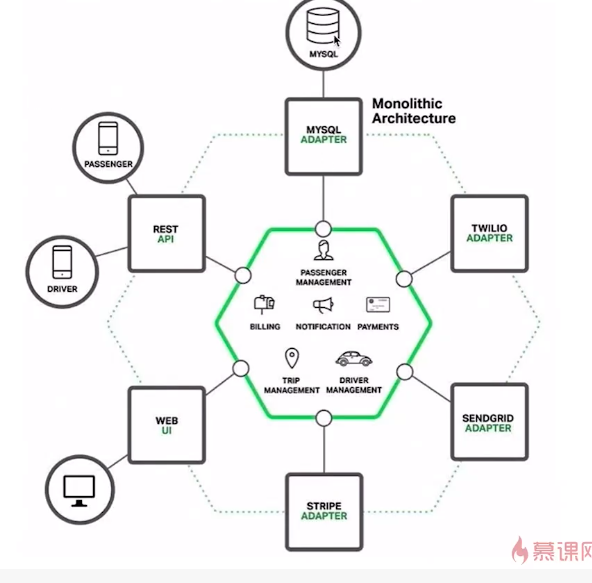

# 微服务介绍

什么是微服务

微服务的特点

微服务服务的优缺点

两大门派: Spring Cloud 和 Dubbo

微服务的拆分: 常用的拆分规则和场景

微服务扩展: 水平扩展和纵向扩展

微服务的重要模块: 注册, 发现, 网关, 负载均衡. 模块和典型选型

# 什么是微服务

## 微服务和单体服务

单体服务:

* 部署效率低下. 代码, 依赖越来越多. 编译打包部署时间很长. 线上发布, 服务启动时间很长. 一般又灰度发布, 每次上线时间太长.
* 团队写作开发成本过高. 
* 系统可用性差. 所有功能在同一个包, 系统跑在一个进程内, 一个功能出现问题, 整个都会出现问题.

---

针对这些问题, 提出了服务化的思想:

* 把传统的单机应用中的本地方法调用, 改造成通过**RPC, HTTP产生的远程方法调用**.

* 把模块从单体应用中拆分出来, 独立成一个服务部署 -> 代码复用, 业务理解, 解耦

* 例如: 用户模块就可以独立开发, 测试, 上线和运维, 可以交由专门的团队来做, **与主模块不耦合**

请求走到网关进行转发, 微服务中一个一个独立模块, 对外通过api提供服务

---

微服务:

* 一种架构风格

* 开发单个应用作为一系列**小型服务**(用户模块, 订单模块等)的套件, 其中每个服务都运行在**自己的进程**中, 并且通过**轻量级的机制**实现彼此间的通信, 这通常是**HTTP**资源API

* 这些服务是围绕着业务功能构建的, 并且可以通过完全**自动化的部署**机制进行独立部署

* 这些服务的集中式管理做到了最小化(例如docker相关技术), 每一种服务都可以通过**不同的编程语言**进行编写, 并且可以使用**不同的数据存储技术**

## 微服务的特点

* 组件以**服务**形式来提供. 微服务是面向服务的, 以独立部署的服务来作为一个个组件, 而不是提供类库和方法之间的本地调用. 需要明确服务之间的接口和协议
* 微服务是产品不是项目. 对产品的整个生命周期负责, 
* 轻量级通信, 独立进程. 更倾向于RESTful, rpc, http. 轻量级的消息队列, rabbitMQ. 
* **分散**治理, 去中心化治理. 责任下放, 需要告警等监控
* **容错性**设计. 每个服务独立, 对每个模块需要有日常的故障检测, 某个模块出错会导致其他模块
* 团队组织架构的调整

## 微服务的优缺点

优点:

* 服务简单, 便于学习和上手, 相对易于维护. 一开始模块少
* 独立部署, **灵活**扩展

* 技术栈丰富. 可以实验新技术, 从边缘模块开始

缺点:

* 运维成本过高

* 接口可能不匹配. 

* 代码可能重复
* 架构复杂度提高. 每一个模块的复杂度降低, 但是整体架构更复杂了

---

## 微服务的两个门派

### Spring Cloud和Dubbo

* Spring Cloud: 众多子项目. 成熟的微服务框架系列. 不仅是某一个模块, 而是整个微服务提供解决方案. 众多的子项目: 网关, 配置中心, 服务注册, 服务发现, 智能路由, 全局锁等
* dubbo: 高性能, 轻量级的开源Java RPC框架, 它提供了三大核心能力: 
  * 面向接口的远程方法调用
  * 智能容错和负载均衡
  * 服务自动注册和发现

可以看到, dubbo提供的能力是Spring Cloud的一个子集

### 整体对比

| 核心组件     | Dubbo     | Spring Cloud                 |
| ------------ | --------- | ---------------------------- |
| 服务注册中心 | Zookeeper | Spring Cloud Netflix Eureka  |
| 服务调用方式 | RPC       | REST API                     |
| 服务网关     | 无        | Spring Cloud Netflix Zuul    |
| 断路器       | 不完善    | Spring Cloud Netflix Hystrix |
| 分布式配置   | 无        | Spring Cloud Config          |
| 服务跟踪     | 无        | Spring Cloud Sleuth          |
| 消息总线     | 无        | Spring Cloud Bus             |
| 数据流       | 无        | Spring Cloud Stream          |
| 批量任务     | 无        | Spring Cloud Task            |

无: 并不是无法实现, 只是dubbo不提供, dubbo可以和其他的框架组件进行整合. 例如:Config可以使用百度的disconf, 淘宝的diamond来实现. 服务跟踪可以使用京东的Hydra. 批量任务可以使用当当Elastic-Job

### 通信协议对比

dubbo: RPC

Spring Cloud: REST(http协议)

* RPC: 整体效率高, 传输同样体量的内容, 网络传输内容更小速度更快. 

* RPC缺点:
  * 服务提供方和消费方依赖方式太强. dubbo RPC不是通用的协议, 需要找到对应的依赖, 代码级别的强依赖. REST类似一纸契约, 不存在强依赖, 也是因为不存在代码级别的强依赖, 可能定义的内容和实际提供的内容不一致
  * dubbo对平台(语言)敏感, 难以简单复用. 如果要对外提供服务, 需要额外实现一层代理, 把RPC接口转换成http才可以对外发布. Spring Cloud本身已经对外提供服务, 更好的复用性

### 文档质量

Dubbo的文档提供了中文与英文两种版本, 细致

Spring Cloud文档体量大, 更多的是偏向整合, 更深入的使用方法还是需要查看其整合组件的详细文档

### 选型建议

dubbo阿里系, 中间停止更新了一段时间.

Spring Cloud类似品牌机, 稳定可靠

Dubbo类似组装机, 自由度高, 但是需要自己承担兼容性测试. 

自身的研发水平和所处阶段

# 微服务拆分

## 拆分的时机

第一阶段的主要目标是快速开发和验证想法, 验证产品是否可行. 此时功能设计不用太复杂. 一开始功能都在一起, 做集中的开发测试运维, 高效成本低, 如果通过就进行下一步的迭代. 

进一步增加更多的新特性来吸引更多的目标用户

同时进行开发的人员超过10人, 这个时候就该考虑进行服务化拆分了

应用越来越庞大了之后, 就要考虑拆分了

## 不适合拆分的情况

* 小团队, 创业初期, 快速做出雏形. 技术基础薄弱

* 流量不高, 压力小, 业务变化也不大. 场景: 企业内部管理系统

* 对延迟很敏感的低延迟高并发系统. 微服务通信的时延比单体的高, 因为网络通信调用

## 拆分的方法

### 纵向拆分

按照业务维度拆分, 关联程度紧密的就拆分成一个微服务.

社交app: 评论一个微服务, 消息通知一个微服务, 个人主页一个微服务

### 横向拆分

按照公共领域拆分.

社交app的服务都要用到用户这个模块, 纵向拆分的时候每个都要实现自己的用户功能, 成本高. 所以把用户服务横向拆分出来, 功能提供给各个模块, 复用用户服务

---

两者根据业务综合分析, 可以结合使用. 

## 微服务扩展

x轴: 水平复制. 单体应用最典型的扩展方式, 把整个系统作为整体, 多部署几套, 前面加上负载均衡即可. -> 水平复制效果不是很好, 存在资源浪费 -> y轴, 功能解耦

y轴: 功能解耦. 微服务拆解, 

z轴: 数据分区. 数据库拆分. 例如: VIP用户单独拆出来一个库. 按照手机尾号拆分数据库

---

自动按需扩展

* 根据CPU负载程度, 特定时间(比如周末), 消息中间件的队列长度, 业务具体规则, 预测等来决定是否扩展. 对各个维度做评判, 达到阈值时, 自动扩展

* 自动分配一个新的服务实例, 提高可用性

* 提高了可伸缩性(双11之后, 自动减少服务器)

* 具有最佳使用率, 节约成本

# 微服务重要模块

以一次基本的服务调用为例. Consumer调用Provider的时候, 需要经历的步骤: 

provider描述服务. 是http服务还是其他类型的服务, 如果是http服务, 接口是什么样子, 返回的内容.

provider注册中心注册服务. 暴露给consumer

服务框架. 统一工作. 协议是TCP, UDP还是http. 传输方式: 同步异步, 单链接or多路复用. 数据是否需要压缩, 压缩格式. 提高网络利用率. json序列化还是java对象序列化

复杂均衡. 多个provider时

熔断与降级. 保险措施, 虽然某个模块无法提供服务, 但是有兜底策略

网关. 服务多了之后, 用户不可能每个请求打到不同的地址, 用户也不知道地址是什么. 提供统一的网关给用户, 用户都打到网关, 由网关做下一步的分发. 同时网关还可以做到统一转换, 权限校验, 过滤器.

# 案例: 新零售业务商品中心微服务化过程

-> 技术专家18周 chapter1 1-7

